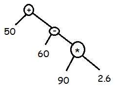

How to use
----------

write your expression in the upper text area. you can define variables using "|"  
variables must be defined as key=value,key=value... do not use any spaces here (I am too tired to fix)

Explanation
-----------

### Tokenization

Input is turned into tokens:  
`50 + 60 - (90 * 2.6)`  
evaluates to:  
`["50", "+", "60", "-", "(", "90", "*", "2.6", ")"]`

### Types

we use the tokens generated in prev. step and give them types:  
`[value(50), op(+), value(60), op(-), par[value(90), op(*), value(2.6)]]`  
values inside parenthesis are recursively nested

### Grouping

operators are used to group values together, forming a binary tree (i think..)  

### Evaluation

to be frank I have no idea how tech people call it but it works like this:  
start at the top (50 + node) if you encounter node, you evaluate it (60 - node) and return result  
if you follow nodes like this, you get a result because they have to end somewhere  
and if everything works we should get -124

Limitations
-----------

it does not like dumb people, if you write nonsense you get nonsense  
also expression: `5+5 6` evaluates to 10 because 6 does not have anyone to group with using operator  
`(5+6)` is invalid, because it is the same case as 5+5 6, it would be valid if there was something to group it with `(5+6) + 1`  
this version is not production ready and never will be, it is just my way of exploring expression parsers

What did I learn
----------------

I hate JS. I hate JS. I hate JS. I hate JS. I hate JS. I hate JS. I hate JS. I hate JS. I hate JS. I hate JS. I hate JS. I hate JS. I hate JS. I hate JS. I hate JS. I hate JS. I hate JS. I hate JS. I hate JS. I hate JS. I hate JS. I hate JS. I hate JS. I hate JS. I hate JS. I hate JS. I hate JS. I hate JS. I hate JS. I hate JS. I hate JS. I hate JS. I hate JS. I hate JS. I hate JS. I hate JS. I hate JS. I hate JS. I hate JS. I hate JS. I hate JS. I hate JS. I hate JS. I hate JS. I hate JS. I hate JS. I hate JS. I hate JS. I hate JS. I hate JS. I hate JS. I hate JS. I hate JS. I hate JS. I hate JS. I hate JS. I hate JS. I hate JS. I hate JS. I hate JS. I hate JS. I hate JS. I hate JS. I hate JS. I hate JS. I hate JS. I hate JS. I hate JS. I hate JS. I hate JS. I hate JS. I hate JS. I hate JS. I hate JS. I hate JS. I hate JS. I hate JS. I hate JS. I hate JS. I hate JS. I hate JS. I hate JS. I hate JS. I hate JS. I hate JS. I hate JS. I hate JS. I hate JS. I hate JS. I hate JS. I hate JS. I hate JS. I hate JS. I hate JS. I hate JS. I hate JS. I hate JS. I hate JS. I hate JS. I hate JS. I hate JS. I hate JS. I hate JS. I hate JS. I hate JS. I hate JS. I hate JS. I hate JS. I hate JS. I hate JS. I hate JS. I hate JS. I hate JS. I hate JS. I hate JS. I hate JS. I hate JS. I hate JS. I hate JS. I hate JS. I hate JS. I hate JS. I hate JS. I hate JS. I hate JS. I hate JS. I hate JS. I hate JS. I hate JS. I hate JS. I hate JS. I hate JS. I hate JS. I hate JS. I hate JS. I hate JS. I hate JS. I hate JS. I hate JS. I hate JS. I hate JS. I hate JS. I hate JS. I hate JS. I hate JS. I hate JS. I hate JS. I hate JS. I hate JS. I hate JS. I hate JS. I hate JS. I hate JS. I hate JS. I hate JS. I hate JS. I hate JS. I hate JS. I hate JS. I hate JS. I hate JS. I hate JS. I hate JS. I hate JS. I hate JS. I hate JS. I hate JS. I hate JS. I hate JS. I hate JS. I hate JS. I hate JS. I hate JS. I hate JS. I hate JS. I hate JS. I hate JS. I hate JS. I hate JS. I hate JS. I hate JS. I hate JS. I hate JS. I hate JS. I hate JS. I hate JS. I hate JS. I hate JS. I hate JS. I hate JS. I hate JS. I hate JS. I hate JS. I hate JS. I hate JS. I hate JS. I hate JS. I hate JS.
